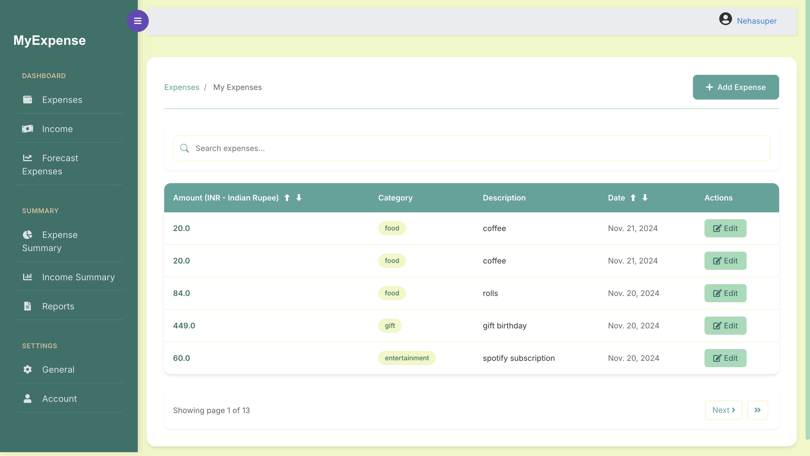
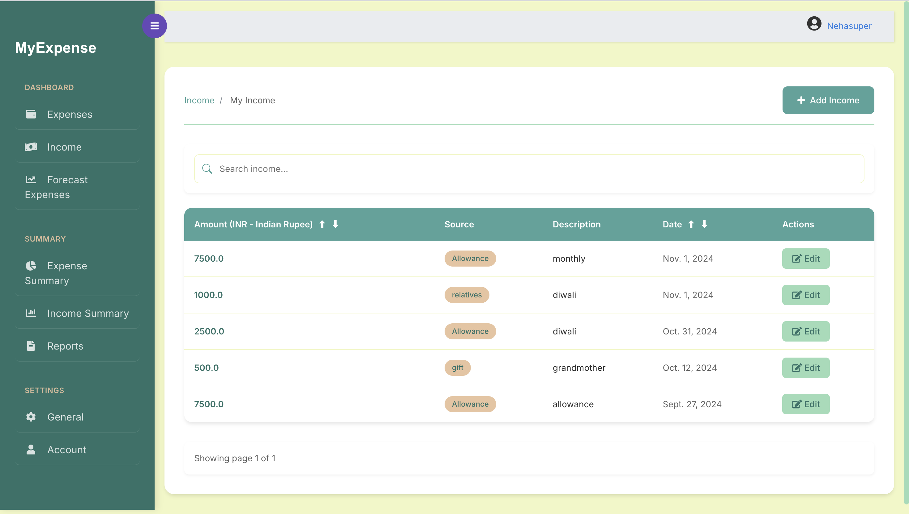
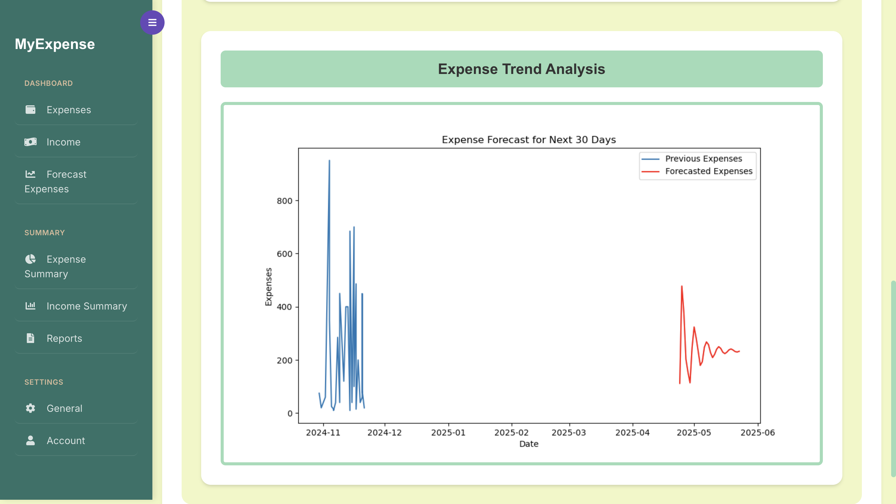

# MyExpenseProject

## Overview
This is a personal expense tracker web application built using Django. It allows users to log their expenses, categorize them, and provides automated expense categorization and future expense prediction features.

## Screenshots

### Expense Dashboard


### Income Tracking


### Expense Forecasting


## Features
- User authentication and account management
- Expense tracking and categorization
- Income recording
- Expense forecasting using machine learning
- Custom reporting and data visualization
- Currency preference settings
- Responsive design with modern UI

## Setup

### Create a Virtual Environment 
Create a virtual environment:
```bash
python -m venv venv
```

### Activate the Virtual Environment
- **Windows**:
  ```bash
  venv\Scripts\activate
  ```
- **macOS and Linux**:
  ```bash
  source venv/bin/activate
  ```

### Install Dependencies
Install the required dependencies:
```bash
pip install -r requirements.txt
```

### Apply Database Migrations
Apply the necessary database migrations:
```bash
python manage.py migrate
```

### Create a Superuser
Create a superuser account to access the admin panel:
```bash
python manage.py createsuperuser
```

### Start the Development Server
Start the Django development server:
```bash
python manage.py runserver
```

### Access the Application
Open your web browser and go to [http://localhost:8000](http://localhost:8000) to access the application.

## Technology Stack
- Django: Web framework
- Bootstrap: Frontend framework
- SQLite: Database
- Chart.js: Data visualization
- Machine Learning: Expense categorization and forecasting

## Contributors
- [Neha Pal](https://github.com/nehapal22)
